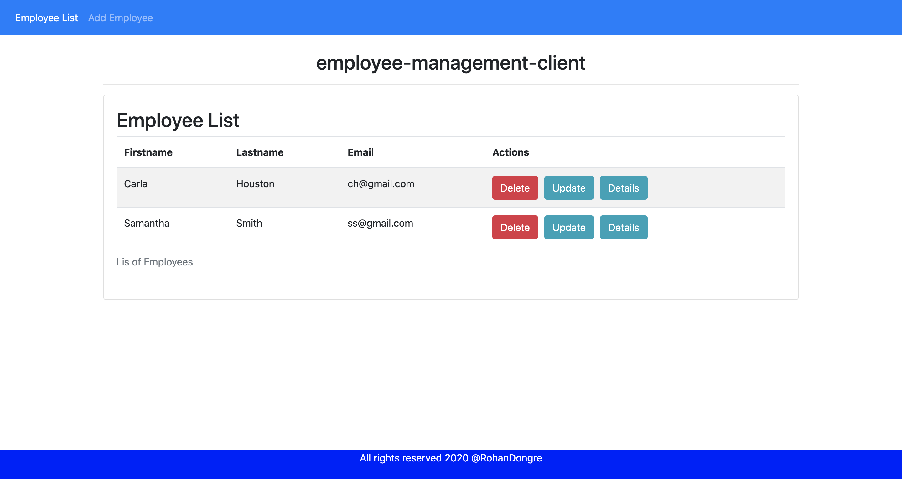
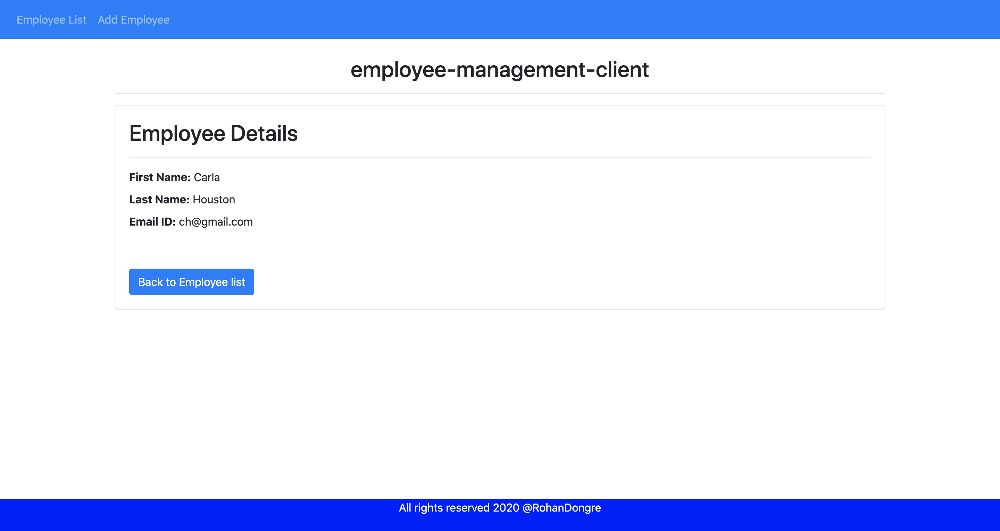
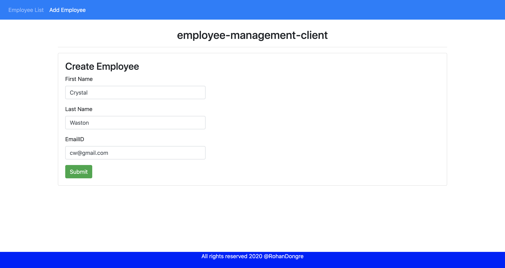
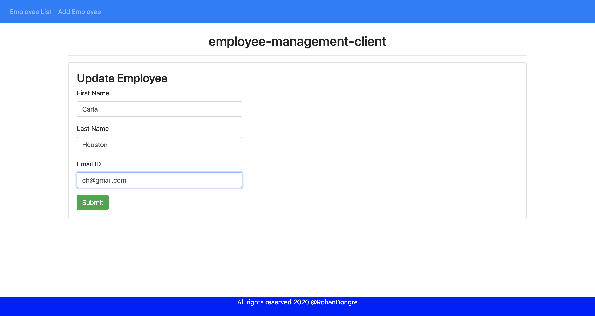

# EmployeeManagementClient

This project was generated with [Angular CLI](https://github.com/angular/angular-cli) version 10.0.8.

## Development server

Run `ng serve` for a dev server. Navigate to `http://localhost:4200/`. The app will automatically reload if you change any of the source files.

## Employee Management REST API

Please visit https://github.com/dongrerohan421/employee-management-application

- **Get employees:**
  

- **Get employee:**
  

- **Create employee:**
  

- **Update employee:**
  
